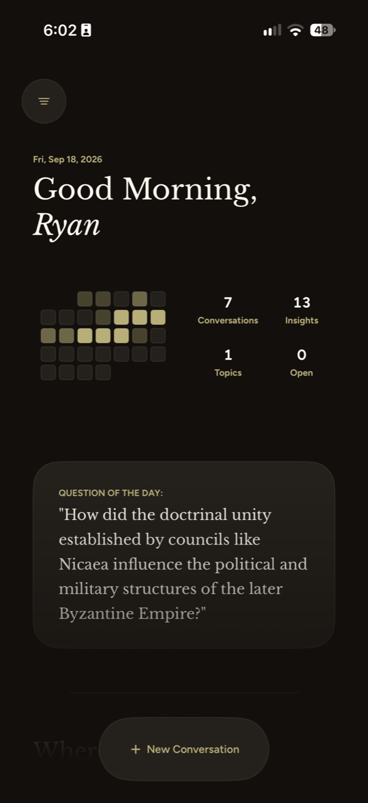
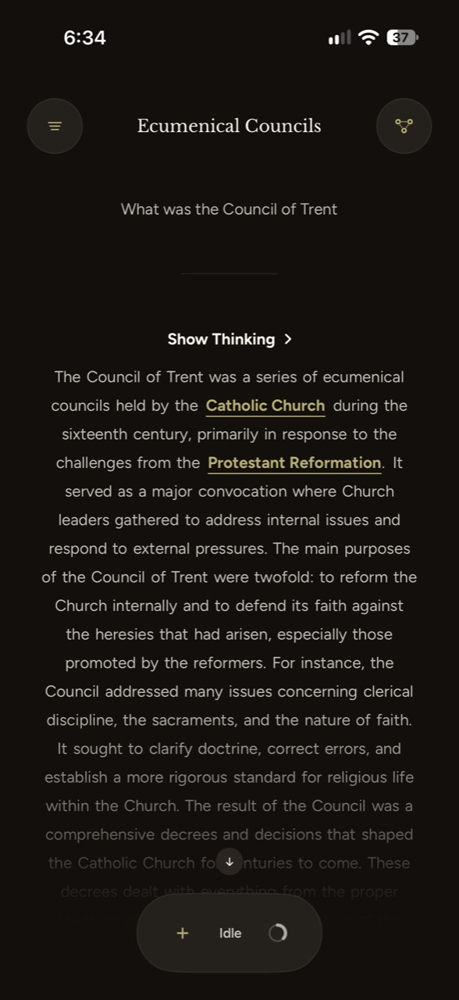
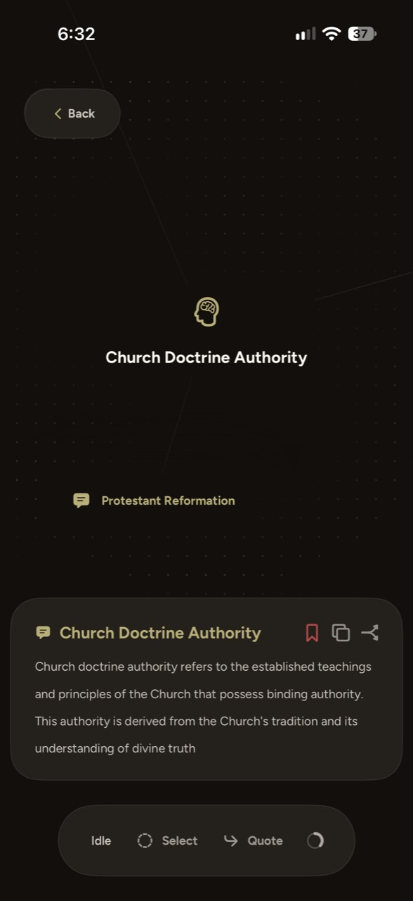
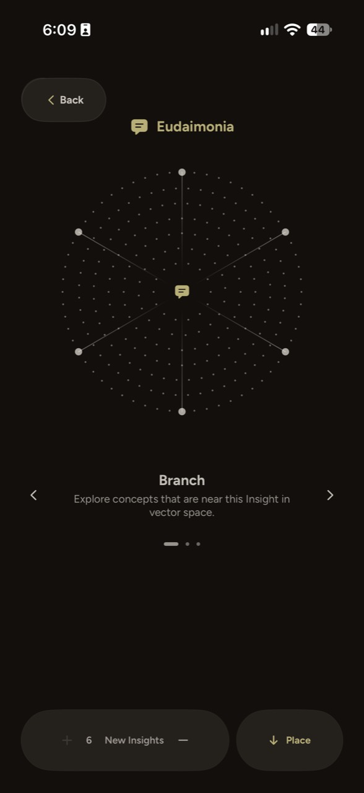

<p align="center">
  
</p>

# Aquinas

**A private, local-first space for serious questions.**

<p>
  
  
  
  
</p>

Aquinas is an iOS study and conversation app for exploring philosophy, theology, Scripture, and
the questions that deserve more than a quick answer. Inspired by the Thomistic tradition, it pairs
thoughtful conversation with source-grounded study and a visual map of the ideas a person is
developing over time.

It is being built for people who want room to think: students, seekers, teachers, and anyone
working through questions of faith, meaning, truth, or human flourishing.

> **Project status:** active development. Aquinas is not a hosted chat product or a finished
> consumer release. The app is being refined as a private, local-first study environment.

## What it does

- **Supports sustained inquiry.** Start a conversation, follow an idea into a branch, and return
  to the thread later without losing the shape of the question.
- **Keeps study close to sources.** Aquinas can retrieve relevant passages from a bundled local
  library—including Scripture, Aquinas, patristic writing, creeds, and conciliar texts—so
  source-dependent answers are tied to available evidence.
- **Builds an Insight Tree.** Save contextual definitions and important concepts, then explore the
  relationships between them in a spatial, evolving map.
- **Stays local by design.** The intended product keeps conversations, retrieval, and model work
  under the user's control rather than requiring an account or a cloud conversation history.

## Highlights

| Area | Experience |
| --- | --- |
| Conversation | Branch a line of inquiry, return to it later, compact older context, and keep the visible transcript intact. |
| Study | Open contextual definitions, save durable Insights, and explore relationships in the Insight Tree. |
| Sources | Retrieve relevant passages from a bundled local library for source-dependent questions. |
| Reflection | Return to a Question of the Day, loose threads, historical prompts, and other optional study cues. |
| Privacy | Keep the intended production experience local-first, with no account or cloud conversation history requirement. |

## Screenshots

<p align="center">
  
  
  
  
</p>

From left to right: the Home dashboard, a source-oriented conversation with contextual Insights,
the Insight Tree, and focused Study mode.

## A note on privacy and current development

Aquinas is a local-first project, not a hosted chat service. The iOS app is designed to use an
on-device language model and local source retrieval. A Mac-hosted backend remains part of the
development workflow for integration, validation, and some advanced tree features; it is not the
intended production data boundary.

This repository is an active development project. The local model and grounding assets are large
and intentionally excluded from source control, so a full on-device experience requires the
corresponding development assets.

## For contributors

The app is one part of a three-repository project. The backend supports development-time model,
retrieval, and Insight Tree integration; the Foundations repository holds the shared product and
architecture contracts.

| Repository | Role |
| --- | --- |
| [Aquinas Backend](https://github.com/rbaltodano/Aquinas-Backend) | Local FastAPI/MLX development service, corpus tooling, evaluation, and persistent conversation-tree data. |
| [Aquinas Foundations](https://github.com/rbaltodano/Aquinas-Foundations) | Shared product, design, model-integration, and Insight Tree documentation. |

Before contributing, read [`AGENTS.md`](AGENTS.md). It routes implementation work to the focused
architecture, runtime, workflow, and cross-repository documents without making the README carry
internal development detail.

## Repository guide

| Path | What you'll find |
| --- | --- |
| `Aquinas-iOS/App` | App entry point and overall navigation shell |
| `Aquinas-iOS/Features` | Conversation, Home, Insight Tree, Library, and settings experiences |
| `Aquinas-iOS/DesignSystem` | Typography, colors, and shared interface elements |
| `Aquinas-iOS/Services` | Model runtime, local grounding, and development-backend boundaries |
| `Aquinas-iOS/Persistence` | Local conversation and Insight state |
| `Aquinas-iOSTests` | Focused behavior and regression coverage |

## Open the project

Open `Aquinas-iOS.xcodeproj` in Xcode. The project targets iOS 26.4 and uses a concrete arm64
simulator destination when building from the command line:

```sh
xcodebuild -project Aquinas-iOS.xcodeproj -scheme Aquinas-iOS \
  -destination 'platform=iOS Simulator,name=iPhone 17' build
```

The README is intentionally public-facing. Detailed architecture, runtime constraints, and agent
guidance are routed from [`AGENTS.md`](AGENTS.md).

## License

Copyright © 2026 Ryan Baltodano. All rights reserved. The source is public for reference and
review; see [`LICENSE`](LICENSE) for details.
